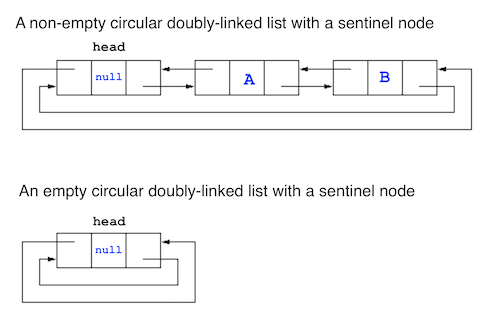

<br>

This assignment will implement a doubly linked list that stores arbitrary objects via class templates. The list will dynamically 
allocate nodes as necessary for space efficiency.


<br>

### Getting Started

--- --- --- --- --- --- --- --- --- --- --- --- --- --- --- --- --- --- --- --- --- --- --- ---

If you don't already have one, create a directory on your **H:** drive named **CS350** (or anywhere else you choose). 
Navigate into this new directory and create a subdirectory named **assignments**.

Download [LinkedList.zip](LinkedList.zip), saving it into the **assignments** directory. 

Double-click on **LinkedList.zip** and extract the contents of the archive into a subdirectory called **LinkedList**

For this assignment, a static library has been provided (containing working versions of each method) to allow for testing of 
each class method independently. Any unimplemented methods in **LinkedList.cpp** will use the corresponding method from the 
library, thus you can implement the methods in any order. Be sure to test each method you implement individually against 
the library for proper operation which can be accomplished by uncommenting the appropriate **```#define```** in the 
file **Flags.h** (and commenting the line containing **```#define ALL 1```**).  
**DO NOT MODIFY ANY OF THE OTHER ```.h``` FILES INCLUDED WITH THE ASSIGNMENT**.
  

The class declaration is 

```cpp
template <class T>
class LinkedList
{
public:
	LinkedList();                      // Default constructor
	LinkedList(const LinkedList & rhs);    // Copy constructor
	~LinkedList();                     // Destructor

	// Public interface
	void insert(const T & x);      // Insert new node
	void remove(const T & x);      // Remove existing node
	const T & getFirst() const;    // Retrieve first list element
	const T & getLast() const;     // Retrieve last list element
	bool find(const T & x) const;  // Find element in list
	bool isEmpty() const;          // Check for empty list
	void makeEmpty();              // Clear list contents
	void printList();              // Display current list elements

	// Operators
	const LinkedList & operator=(const LinkedList & rhs);	// Assignment operator
		  
	// (Private) sentinel node
	Node<T> *dummy;				// Sentinel node

	// (Private) utility method
	Node<T> * findNode(const T & x) const;	// Find node with specified value
};
```


<br>

### 1. Constructor / Destructor

--- --- --- --- --- --- --- --- --- --- --- --- --- --- --- --- --- --- --- --- --- --- --- ---

Since the list will grow dynamically as needed, the only purpose of the constructor is to create and initialize the 
sentinel (i.e. dummy) node.

**Important**: the list should be a *circular* list, meaning that

  - the head node (the node containing the first value in the sequence) should be the successor of the dummy node, and
  - the tail node (the node containing the last value in the sequence)
  should be the predecessor of the dummy node
  - when the list is empty, the **```prev```** and **```next```** fields of the dummy node should point to itself.

The figure below shows examples of non-empty and empty circular doubly-linked lists with a sentinel node:
 



**Tasks**

  - Add code to **```LinkedList()```** (in **```LinkedList.cpp```**) to *dynamically* allocate **```dummy```** as 
  a  **```Node```**. Do not forget to set the **```next```** and **```prev```** pointers of **```dummy```** appropriately.
  Also, initialize the contents of the **```dummy```** to 0.
  
  - Add code to **```~LinkedList()```** (in **```LinkedList.cpp```**) to free all **```Node```**s in the list and then 
  deallocate **```dummy```**. **Hint:** Consider using the **```makeEmpty()```** method.


<br>

### 2. GetFirst() / GetLast()

--- --- --- --- --- --- --- --- --- --- --- --- --- --- --- --- --- --- --- --- --- --- --- ---

These methods will return the value stored in the first/last node in the list (as long as the list is not empty). Note 
both operations should take O(1), i.e. constant, time.

**Tasks**

  - Add a method named **```getFirst()```** that returns a **```const```** *reference* to a **```T```** object that is 
  stored in the first node in the list, or the contents of the sentinel node if the list is empty (for this assignment, the 
  sentinel node will contain **0**). **Hint:** Consider how the first list node can be directly accessed through the 
  **```dummy```** sentinel node.
  
  - Add a method named **```getLast()```** that returns a **```const```** *reference* to a **```T```** object that is 
  stored in the last node in the list, or the contents of the sentinel node if the list is empty (for this assignment, the 
  sentinel node will contain **0**). **Hint:** Consider how the last list node can be directly accessed through the 
  **```dummy```** sentinel node.


<br>

### 3. Find() / FindNode()

--- --- --- --- --- --- --- --- --- --- --- --- --- --- --- --- --- --- --- --- --- --- --- ---

Finding arbitrary elements in a linked list typically requires a linear search of the elements in the array. The public 
interface method will simply return (a **```bool```**) whether or not the desired element is in the list. However, it is 
often convenient to know which **```Node```** contains the element as this (private) method can be used in other 
methods, e.g. **```remove()```**.

**Tasks**

  - Add a method named **```find()```** that returns a **```bool```** (do not forget to qualify it with the class name) 
  that takes a single **```const```** *reference* to a **```T```** object parameter and determines if the value is in the 
  list. **Hint:** The method can use the **```findNode()```** method and simply check if the returned node is valid 
  (indicating the value was found in the list).
  
  - Add a method named **```findNode()```** (do not forget to qualify it with the class name) that also takes a 
  single **```const```** *reference* to a **```T```** object parameter and returns a *pointer* to a **```Node```** that 
  contains the desired value. **Hint:** This method should start at the first valid **```Node```**, i.e. *not* the sentinel, 
  and perform a *linear search* until either the value is found or the end of the list is reached. If the value is not 
  found, simply return the address of the sentinel node. Pseudocode for this routine (from CLRS *Introduction to 
  Algorithms* where **```nil```** is the sentinel node) is given as

```
LIST-SEARCH(L, k)
1   node = L.nil.next
2   while node != L.nil and node.key != k
3      node = node.next
4   return node
```


<br>

### 4. Insert()

--- --- --- --- --- --- --- --- --- --- --- --- --- --- --- --- --- --- --- --- --- --- --- ---

This operation should add elements at the **head** of the list.

**Tasks**

  - Add a **```void```** method named **```insert()```** (do not forget to qualify it with the class name) that takes a 
  parameter of type **```T```** and inserts a **```Node```** containing the data at the head of the list. **Hint:** Be 
  sure to adjust the pointers for **```dummy```** as well as those of the new *dynamically allocated* node. The following 
  is pseudocode for the insert procedure (from CLRS *Introduction to Algorithms* where **```nil```** is the sentinel node)

```
LIST-INSERT(L, node)
1   node.next = L.nil.next
2   L.nil.next.prev = node
3   L.nil.next = node
4   node.prev = L.nil
```


<br>

### 5. Remove()

--- --- --- --- --- --- --- --- --- --- --- --- --- --- --- --- --- --- --- --- --- --- --- ---

This operation should remove an existing node containing a given value from the list. The list will have to be searched 
first to locate the desired node.

**Tasks**

  - Add a **```void```** method named **```remove()```** (do not forget to qualify it with the class name) that takes 
  a **```const```** *reference* to a **```T```** object parameter. **Hint:** The **```Node```** that contains the 
  parameter value first needs to be found (consider the **```findNode()```** method). Once the valid **```Node```** is 
  found, it can be *spliced* from the list by reassigning the pointers of its preceding and subsequent **```Node```**s 
  in the list. Pseudocode for the remove routine (from CLRS *Introduction to Algorithms* where *nil* is the sentinel node) 
  is shown below
   
  - **DO NOT FORGET TO FREE THE MEMORY THAT WAS USED BY THE DELETED NODE**

```
LIST-DELETE(L, node)
1   node.prev.next = node.next
2   node.next.prev = node.prev
```


<br>

### 6. IsEmpty()

--- --- --- --- --- --- --- --- --- --- --- --- --- --- --- --- --- --- --- --- --- --- --- ---

A private method which simply returns a boolean indicating whether or not the current list contains any valid, i.e. 
non-sentinel, nodes.

**Tasks**

  - Add a method named **```isEmpty()```** (do not forget to qualify it with the class name) that takes no parameters and 
  returns a **```bool```** indicating *true* if the list contains no non-sentinel nodes, i.e. when the list is empty.


<br>

### 7. MakeEmpty()

--- --- --- --- --- --- --- --- --- --- --- --- --- --- --- --- --- --- --- --- --- --- --- ---

This method should deallocate all the nodes in the list *except* the sentinel node and reset the pointers for the 
sentinel node.

**Tasks**

  - Add a **```void```** method named **```makeEmpty()```** (do not forget to qualify it with the class name) that takes 
  no parameters. It should traverse the list removing each non-sentinel node *individually* such that only the 
  **```dummy```** node remains in the list.


<br>

### 8. Copy constructor / Assignment operator

--- --- --- --- --- --- --- --- --- --- --- --- --- --- --- --- --- --- --- --- --- --- --- ---

Often it is advantageous in a data structure to provide a *copy constructor* which will create a new data structure from 
an existing one, i.e. make a *copy* of a current list. This process can be done manually or can take advantage of an 
overloaded *assignment operator*, i.e. = method which performs the copy of the data structure contents.

**Tasks**

  - Add a constructor method (do not forget to qualify it with the class name) that takes a **```const```** *reference* 
  to a **```LinkedList<T>```** object, i.e. another list object, parameter. Create a new **```Node<T>```** for 
  the **```dummy```** node of the new list and either:
    
    - manually create new **```Node```**s for the new list with nodes that contain identical values as those in the list 
    that was passed in as a parameter, i.e. **```lst```**. <br>**OR**
    
    - simply *assign* the parameter list to the new list and implement an *assignment operator* (e.g. **```*this = lst```**)

  - Add an assignment operator method (do not forget to qualify it with the class name) that takes a **```const```** 
  *reference* to a **```LinkedList<T>```** object, i.e. another list object, parameter and returns a **```const```** 
  *reference* to a **```LinkedList<T>```** object, i.e. the current one. The method should insert nodes into the new list 
  with values identical to those from the parameter list. Note that the current list should already have a 
  **```dummy```** node so you do not need to create one in this method.  **Hint:** Use the **```insert()```** function 
  to add the new nodes.


<br>

### 9. Compiling and running the program

--- --- --- --- --- --- --- --- --- --- --- --- --- --- --- --- --- --- --- --- --- --- --- ---

Once you have completed implementing any of the above methods (the remaining unimplemented methods will be drawn from the 
static library):

**In CLion:**  
From the "Run" menu, select "Run" (or click the "Run" button in the top right of the IDE)

**In the terminal:**  
Navigate to the directory containing the source files and run the command **```make```** to compile.

Run the command **```./LinkedList```**.

Congratulations, you have just written your first C++ data structure that uses templates!


<br>
    
### 10. Testing your data structure
    
--- --- --- --- --- --- --- --- --- --- --- --- --- --- --- --- --- --- --- --- --- --- --- ---
    
The test program that is distributed with this programming assignment (**```tests.cpp```**) includes a variety of 
tests to verify the functionality of your newly created data structure.  However, the tests that are included with 
this assignment are not necessarily extensive and may not test all of the edge cases for your data structure. 

Part of developing any piece of software is creating the tests required to ensure correctness.  You should 
add any tests necessary to ensure complete correctness of your data structure. A good place to start is to
consider edge cases:

 - What happens when each method is called on an empty data structure?
 - What happens when each method is called on a full data structure?
 - What happens when each method is called on a data structure that has a single element?
 
**Be assured, that when your programming assignment is graded these edge cases (and more) will be tested.**

The testing framework used in **```tests.cpp```** in called [Catch](https://github.com/philsquared/Catch). 
Documentation can be found on the [Catch website](https://github.com/philsquared/Catch). 


<br>
    
### 11. Checking for memory leaks
    
--- --- --- --- --- --- --- --- --- --- --- --- --- --- --- --- --- --- --- --- --- --- --- ---
    
Memory leaks are the result of memory that is allocated but not properly freed.  In C++, each
time you use the **```new```** keyword you are allocating memory.  All instances of **```new```** 
should have a corresponding instance of **```delete```** to free the memory that was allocated.
This can be trickier than it sounds. Thankfully, there are tools such as [**```valgrind```**](http://valgrind.org) 
that can automatically analyze your program and detect these types of errors.

To check your program for memory leaks, 

**In CLion:**  
From the "Run" menu, select "Run ... with Valgrind Memcheck" (or click the "Memcheck" button in the top right of the IDE)

**In the terminal:**  
Navigate to the directory containing the source files and run the command **```make memcheck```** from the command line.

Fix any memory leaks that are detected.


<br>

### 12. Grading Criteria

--- --- --- --- --- --- --- --- --- --- --- --- --- --- --- --- --- --- --- --- --- --- --- ---

**75 points**

* Constructor - **5 points**
* Destructor - **5 points**
* getFirst() - **5 points**
* getLast() - **5 points**
* find() - **5 points**
* findNode() - **10 points**
* insert() - **10 points**
* remove() - **10 points**
* isEmpty() - **5 points**
* makeEmpty() - **5 points**
* Copy constructor - **5 points**
* Assignment operator - **5 points**


<br>

### 13. Submitting to Marmoset

--- --- --- --- --- --- --- --- --- --- --- --- --- --- --- --- --- --- --- --- --- --- --- ---

**BE SURE TO REMOVE ALL DEBUG OUTPUT FROM YOUR METHODS PRIOR TO SUBMISSION!**  The only method that should produce 
output is **```printList()```** (and any library methods).

Also, be sure to test ALL of your methods one last time by uncommenting the line **```#define ALL 1```**
in your **Flags.h** file.

When you are done, run the following command from your terminal in the source directory for the project:

	make submit

You will be prompted for your Marmoset username and password,
which you should have received by email.  Note that your password will
not appear on the screen.

**DO NOT MANUALLY ZIP YOUR PROJECT AND SUBMIT IT TO MARMOSET.  
YOU MUST USE THE ```make submit``` COMMAND**.
