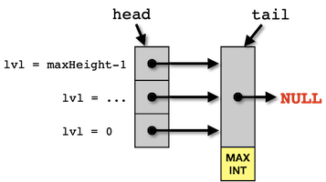
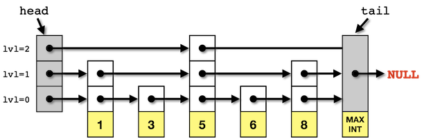

This assignment will implement a skip list that stores arbitrary objects via class templates. The list will dynamically allocate nodes as necessary for space efficiency. Pseudocode for the skip list operations can be found in the original paper [Skip Lists: A Probabilistic Alternative to Balanced Trees](skiplists.pdf) in the June 1990 issue of *Communications of the ACM*. The implementation for this assignment differs slightly from the original documentation in that it will include a sentinel node as a tail.






<br>

### Getting Started

--- --- --- --- --- --- --- --- --- --- --- --- --- --- --- --- --- --- --- --- --- --- --- ---

If you don't already have one, create a directory on your **H:** drive named **CS350** (or anywhere else you choose). 
Navigate into this new directory and create a subdirectory named **assignments**.

Download [SkipList.zip](SkipList.zip), saving it into the **assignments** directory. 

Double-click on **SkipList.zip** and extract the contents of the archive into a subdirectory called **SkipList**.

For this assignment, a static library has been provided (containing working versions of each method) to allow for testing of each class method independently. Any unimplemented methods in **SkipList.cpp** will use the corresponding method from the library, thus you can implement the methods in any order. Be sure to test each method you implement individually against the library for proper operation which can be accomplished by uncommenting the appropriate **```#define```** in the file **Flags.h** (and commenting the line containing **```#define ALL 1```**).  **DO NOT MODIFY ANY OF THE OTHER ```.h``` FILES INCLUDED WITH THE ASSIGNMENT**.
  

The class declaration is 

```cpp
template <class T>
class SkipList
{
public:
    SkipList();
    ~SkipList();

    // Public interface methods
    bool find(const T & x) const;
    void insert(const T & x);
    void remove(const T & x);
    bool isEmpty() const;
    void makeEmpty();
    void printList();

    // (Private) Head array
    Node<T> *head;
    Node<T> *tail;
    int height;
    static const int maxHeight;
    
    // (Private) utility methods
    int randomLevel();
    double getRandomNumber();
};

template <class T>
const int SkipList<T>::maxHeight = 5;
```


<br>

### 1. Constructor / Destructor

--- --- --- --- --- --- --- --- --- --- --- --- --- --- --- --- --- --- --- --- --- --- --- ---

Since the skip list will grow dynamically as needed, the only purpose of the constructor is to create and initialize the **```head```** node and the the **```tail```** (i.e. sentinel) node. Additionally, the constructor should initialize the current height of the SkipList.

**Tasks**

  * Add code to **```SkipList()```** (in **```SkipList.cpp```**) to *dynamically* allocate **```head```** as a  **```Node```**. The data field for the **```head```** node can be initialized with a value of **```T()```**.  The height field for the **```head```** node can be initialized with a value of **```maxHeight```** which is defined and initialized to **```5```** in **```SkipList.h```**.  **IMPORTANT NOTE:** **DO NOT USE** the default constructor when creating the **```head```** node.  The **```Node```** constructor dynamically allocates and initializes the array of **```next```** pointers.  If you use the default constructor, the array of **```next```** pointers will NOT be allocated or initialized correctly.  This will cause memory access errors and segmentation faults in subsequent methods of your **SkipList** implementation.  Instead, pass your data value and the desired height directly to the constructor.
  * Add code to **```SkipList()```** (in **```SkipList.cpp```**) to *dynamically* allocate **```tail```** as a  **```Node```**. The data field for the **```tail```** node can be initialized with the value of **```std::numeric_limits<T>::max()```**. This is the **MAXIMUM** value that can represented for type **```T```**. Using the maximum value ensure that the iterative search phase will never move into the **```tail```** sentinel node. The height field for the **```tail```** node can be initialized with a value of **```1```**.
  * Be sure to complete the initialization of the **```head```** pointer **AFTER** creating the **```tail```** pointer. **ALL** of the **```next```** pointers inside the **```head```** node should point to the **```tail```** (i.e. sentinel) node.
  * Do not forget to initialize the **```height```** field of the SkipList appropriately. When a  **```SkipList```** is first created, the highest level is 1.
  * Add code to **```~SkipList()```** (in **```SkipList.cpp```**) to free all **```Node```**s in the list and then deallocate both the **```head```** and **```tail```** nodes. 


<br>

### 2. Find()

--- --- --- --- --- --- --- --- --- --- --- --- --- --- --- --- --- --- --- --- --- --- --- ---

The advantage of a skip list is the efficiency of the search operation of O(log n). This is accomplished by using the multi-level **```next```** pointer array and the search process which has three cases starting at the highest level of the **```head```** pointer:

	
	1. If the value in the next node is *less than* the desired value, then move the current node to the next node and repeat the search process.

	2. If the value in the next node is *greater than or equal to* the desired value, then drop a level in the current node and repeat the search process.	

	3. If already at the lowest level, move to the next node and examine the value.


**Tasks**

* Add a method named **```find()```** that returns a **```bool```** (do not forget to qualify it with the class name) that takes a single **```const```** *reference* to a **```T```** object parameter and determines if the value is in the list. 

**Hints**

* Use Pugh's pseudocode as a reference. However, keep in mind that you must make appropriate changes for your implementation.
* Pugh's pseudocode indexes arrays at 1.  In C++, arrays are indexed at 0.  Make changes as necessary.


<br>

### 3. Insert()

--- --- --- --- --- --- --- --- --- --- --- --- --- --- --- --- --- --- --- --- --- --- --- ---

Since a skip list maintains elements in *sorted order*, to insert an element requires determining where the element belongs in the list, i.e. searching for the correct location. Hence the insert operation will also be O(log n). To accomplish an insert, we must first determine what level the new node will be inserted at up to one level greater than the current max level of the skip list (usually by a repeated coin toss). Then a procedure similar to search is performed, but since the data structure is implemented with *singly-linked lists*, a local array of pointers is needed to ensure all links are updated correctly when the new node is inserted.

**Task 1**
  * Add a method named **```randomLevel()```** (do not forget to qualify it with the class name) that takes no parameters and returns an **```int```** between 1 and the current highest level of the skip list plus 1 (and no greater than the **```maxHeight```** of the skip list). Use the provided **```getRandomNumber()```** function to generate (deterministic) random numbers and a threshold of 0.5 for continuing to increment the level. **Hint:** Use Pugh's pseudocode as a reference.
  * **IMPORTANT NOTE FOR TASK 1:** There are a total of three conditions that you should be checking to determine how many times you should increment your **```int```**.  Check the return value of **```getRandomNumber()```** FIRST in your boolean expression.  This will ensure that your pseudo-random number generator stays 'synchronized' with the pseudo-random number generator that was used to create the units tests.  If you put your call to **```getRandomNumber()```** as the second or third condition in your boolean expression the call may be short-circuited thereby desynchronizing your pseudo-random number generator and causing some unit tests to fail.
  
**Task 2**
  * Add a **```void```** method named **```insert()```** (do not forget to qualify it with the class name) that takes a parameter of type **```T```** and inserts a **```Node```** containing the data at the appropriate place in the list. You will need to use a local **```update```** array of pointers during the search that remembers the current node when the process drops levels.  **IMPORTANT NOTE:** **DO NOT USE** the default constructor when creating the new **```Node```**.  The **```Node```** constructor dynamically allocates and initializes the array of **```next```** pointers.  If you use the default constructor, the array of **```next```** pointers will NOT be allocated or initialized correctly.  This will cause memory access errors and segmentation faults in subsequent methods of your **SkipList** implementation.  Instead, pass your data value and the desired height directly to the constructor.
  * **HINTS FOR TASK 2:** Once again Pugh's pseudocode is a great reference, but needs some modifications. Since the first portion of the ```insert``` method is basically the ```find``` method, all the hints provided for the ```find``` method apply here as well. 
  
  
  


<br>

### 4. Remove()

--- --- --- --- --- --- --- --- --- --- --- --- --- --- --- --- --- --- --- --- --- --- --- ---

This operation will remove a node from the list (if it exists) and again since it performs a similar search procedure will run in O(log n). Like the insert process, a local array of pointers will need to be created to appropriately update the other nodes in the list when the desired node is deleted. Also if the node to be deleted is the only one currently at the highest level, then the highest level of the skip list should correspondingly be decremented.

**Tasks**
  * Add a **```void```** method named **```remove()```** (do not forget to qualify it with the class name) that takes a **```const```** *reference* to a **```T```** object parameter and removes the node that contains the given value (or does nothing if the value does not exist in the list). You will need to use a local **```update```** array of pointers during the search that remembers the current node when the process drops levels. **Hint:** Use Pugh's pseudocode as a reference.
* **HINTS:** Once again Pugh's pseudocode is a great reference, but needs some modifications. Since the first portion of the ```remove``` method is basically the ```find``` method, all the hints provided for the ```find``` method apply here as well.


<br>

### 5. IsEmpty()

--- --- --- --- --- --- --- --- --- --- --- --- --- --- --- --- --- --- --- --- --- --- --- ---

A private method which simply returns a boolean indicating whether or not the current list contains any valid, i.e. non-head, nodes.
	
**Tasks**

  * Add a method named **```isEmpty()```** (do not forget to qualify it with the class name) that takes no parameters and returns a **```bool```** indicating *true* if the list contains no non-head nodes, i.e. when the list is empty.

  
  
<br>

### 6. MakeEmpty()

--- --- --- --- --- --- --- --- --- --- --- --- --- --- --- --- --- --- --- --- --- --- --- ---

This method should deallocate all the nodes in the list and reallocate a new head node.
	
**Tasks**

  * Add a **```void```** method named **```makeEmpty()```** (do not forget to qualify it with the class name) that takes no parameters. It should traverse the list removing each non-head node *individually* and then reallocate a new **```head```** node. **Hint:** Level 0 is a continuous linked list with all the nodes (and thus the entire pointer array for a particular node can be deallocated once the level 0 next pointer is placed in a temp pointer variable.)


<br>

### 7. Compiling and running the program

--- --- --- --- --- --- --- --- --- --- --- --- --- --- --- --- --- --- --- --- --- --- --- ---

Once you have completed implementing any of the above methods (the remaining unimplemented methods will be drawn from the 
static library):

**In CLion:**  
From the "Run" menu, select "Run" (or click the "Run" button in the top right of the IDE)

**In the terminal:**  
Navigate to the directory containing the source files and run the command **```make```** to compile.

Run the command **```./SkipList```**.

Congratulations, you have just implemented a rather complex C++ data structure that uses templates!


<br>
    
### 8. Testing your data structure
    
--- --- --- --- --- --- --- --- --- --- --- --- --- --- --- --- --- --- --- --- --- --- --- ---
    
The test program that is distributed with this programming assignment (**```tests.cpp```**) includes a variety of 
tests to verify the functionality of your newly created data structure.  However, the tests that are included with 
this assignment are not necessarily extensive and may not test all of the edge cases for your data structure. 

Part of developing any piece of software is creating the tests required to ensure correctness.  You should 
add any tests necessary to ensure complete correctness of your data structure. A good place to start is to
consider edge cases:

 - What happens when each method is called on an empty data structure?
 - What happens when each method is called on a full data structure?
 - What happens when each method is called on a data structure that has a single element?
 
**Be assured, that when your programming assignment is graded these edge cases (and more) will be tested.**

The testing framework used in **```tests.cpp```** in called [Catch](https://github.com/philsquared/Catch). 
Documentation can be found on the [Catch website](https://github.com/philsquared/Catch). 


<br>
    
### 9. Checking for memory leaks
    
--- --- --- --- --- --- --- --- --- --- --- --- --- --- --- --- --- --- --- --- --- --- --- ---
    
Memory leaks are the result of memory that is allocated but not properly freed.  In C++, each
time you use the **```new```** keyword you are allocating memory.  All instances of **```new```** 
should have a corresponding instance of **```delete```** to free the memory that was allocated.
This can be trickier than it sounds. Thankfully, there are tools such as [**```valgrind```**](http://valgrind.org) 
that can automatically analyze your program and detect these types of errors.

To check your program for memory leaks, 

**In CLion:**  
From the "Run" menu, select "Run ... with Valgrind Memcheck" (or click the "Memcheck" button in the top right of the IDE)

**In the terminal:**  
Navigate to the directory containing the source files and run the command **```make memcheck```** from the command line.

Fix any memory leaks that are detected.


<br>

### 10. Grading Criteria

--- --- --- --- --- --- --- --- --- --- --- --- --- --- --- --- --- --- --- --- --- --- --- ---

**100 points**

* Constructor - **5 points**
* Destructor - **5 points**
* find() - **20 points**
* insert() - **25 points**
* randomLevel() - **5 points**
* remove() - **25 points**
* isEmpty() - **5 points**
* makeEmpty() - **10 points**


<br>

### 11. Submitting to Marmoset

--- --- --- --- --- --- --- --- --- --- --- --- --- --- --- --- --- --- --- --- --- --- --- ---

**BE SURE TO REMOVE ALL DEBUG OUTPUT FROM YOUR METHODS PRIOR TO SUBMISSION!**  The only method that should produce output is **```printList()```** (and any library methods).

Also, be sure to test ALL of your methods one last time by uncommenting the line **```#define ALL 1```**
in your **Flags.h** file.

When you are done, run the following command from your terminal in the source directory for the project:

	make submit

You will be prompted for your Marmoset username and password,
which you should have received by email.  Note that your password will
not appear on the screen.

**DO NOT MANUALLY ZIP YOUR PROJECT AND SUBMIT IT TO MARMOSET.  
YOU MUST USE THE ```make submit``` COMMAND**.
