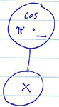
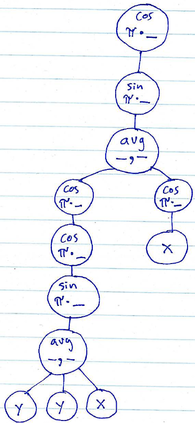

<br>

**Acknowledgment:** The
[idea for this assignment](http://nifty.stanford.edu/2009/stone-random-art/)
comes from [Christopher Stone](http://www.cs.hmc.edu/~stone/)
of Harvey Mudd College.


<br>

### Getting Started

--- --- --- --- --- --- --- --- --- --- --- --- --- --- --- --- --- --- --- --- --- --- --- ---

If you don't already have one, create a directory on your **H:** drive named **CS350** (or anywhere else you choose). 
Navigate into this new directory and create a subdirectory named **assignments**.

Download [RandomArt.zip](RandomArt.zip), saving it into the **assignments** directory. 

Double-click on **RandomArt.zip** and extract the contents of the archive into a subdirectory called **RandomArt**.  
Or, in your terminal, you can traverse to the directory containing your **RandomArt.zip** file and type:

    unzip RandomArt.zip
    
After decompressing the zip file, change directories into the **RandomArt** directory and use the **```make```** 
command to compile the program (if you haven't modified the file yet, you may get some compilation warnings).  After 
successfully compiling the program, you can run it by typing the following in your command line:

    ./RandomArt
    
The program will write an output image in a file called **randomart.bmp**.  It will also print textual representations 
of three functions.

Example:

	R: x
	G: x
	B: x
		
When you're done with this assignment, the functions will be more complex and will look more like the following:

	R: sin(pi*avg(avg(avg(sin(pi*sin(pi*sin(pi*avg(sin(pi*sin(pi*avg(x,x))),y,x)))),sin(pi*sin(pi*avg(sin(pi*sin(pi*sin(pi*sin(pi*x)))),sin(pi*y)))),avg(sin(pi*y),sin(pi*sin(pi*sin(pi*sin(pi*x)))))),y),x))
	G: sin(pi*sin(pi*sin(pi*avg(sin(pi*sin(pi*sin(pi*y))),y,sin(pi*y)))))
	B: sin(pi*sin(pi*avg(sin(pi*sin(pi*avg(sin(pi*sin(pi*sin(pi*sin(pi*y)))),sin(pi*x)))),sin(pi*sin(pi*sin(pi*sin(pi*x)))),y)))


<br>

### Your Task

--- --- --- --- --- --- --- --- --- --- --- --- --- --- --- --- --- --- --- --- --- --- --- ---
    
You have two tasks:

1. Implement a tree data structure
2. Use the tree to represent "random" functions of variables *x* and *y*

The random functions in step 2 are used to create "random art".<br>
Here's the idea:

  - *x* and *y* values are restricted to the range -1 to 1.

  - The random functions are built from operations which are guaranteed to produce values in the range -1 to 1.

  - The random art is created by generating three random functions: one for red, one for blue, one for green.  
  Each pixel in a square region of the GUI window corresponds to an x,y coordinate in the 2x2 region of the x/y plane 
  centered at the origin. Each pixel's color is determined by evaluating the three functions for the pixel's x/y values, 
  and mapping each result to the range 0..255.  This produces three color component values, which together determine 
  the overall color of the pixel.

Here is an example:


The following primitive operations can be used to compose functions which produce values in the range -1..1 
(as long as *x* and *y* are in the same range):

- *x*
- *y*
- *sin* (π \* \_)
- *cos* (π \* \_)
- *average* (\_, \_, ...)

In the above operations, the placeholder "\_" is any expression built from the same set of operations.  Thus, 
operations are nested recursively to represent arbitrary functions.


<br>

#### Representing Functions as Trees

--- --- --- --- --- --- --- --- --- --- --- --- --- --- --- --- --- --- --- --- --- --- --- ---

The random functions are represented by trees consisting of **```ExprNode```** objects.

The **```ExprNod```e** class is defined as follows:

    
```cpp
class ExprNode {
private:
	// TODO: add field(s), e.g., to keep track of child nodes

	// copy constructor and assignment are forbidden: do not implement them
	ExprNode(const ExprNode &);
	ExprNode& operator=(const ExprNode &);

public:
	ExprNode();
	virtual ~ExprNode();

	// Evaluate for given x and y values
	virtual double evaluate(double x, double y) const = 0;

	// Generate a textual representation of the function represented
	// by this node and return it as a string.
	virtual std::string exprAsString() const = 0;

	// TODO: add method(s), e.g., to add a child node, to get a child node, etc.
};
```


<br>
The **```evaluate```** method evaluates the expression for given values of **```x```** and **```y```**.

The **```exprAsString```** method returns a string containing a textual representation of the expression.

You will need to modify this class so that child nodes can be added and accessed.  You can use either a linked list 
or an array to store the references to the child nodes.

**Suggestion:** add the following methods to the **```ExprNode```** class:

```cpp
void addChild(ExprNode *child);
int getNumChildren() const;
ExprNode *getChild(int index) const;
```

These methods will allow you to add and access child nodes.

Note that the **```virtual```** keyword in C++ means "can be overridden". This is used in a superclass to designate 
methods that subclasses may override with their own definitions.

Also note that **```ExprNode```** is an abstract class.  (Virtual methods defined with **```= 0```** at the end are 
abstract.)  You will need to implement concrete subclasses that represent the 5 fundamental operations described above 
(x, y, sin, cos, average).  

The node types representing the variables **```x```** and **```y```** will be the leaves of the overall expression tree.
The node types representing *sin* (π \* \_) and *cos* (π \* \_) expressions will each have a single child.  The node 
type representing *average* (\_, \_, ...) expressions will have 2 or three children.

An implementation of the **```XNode```** class, a subclass of **```ExprNode```**, is provided for you.  It represents an 
expression that evaluates to the specified value of **```x```**.  You can use this as a guide for how to implement the
other **```ExprNode```** subclasses.

**Examples**: here are how two expressions would be represented as trees:

>| **Expression** | cos(π \* x) | cos(π \* sin(π \* avg(cos(π \* cos(π \* sin(π \* avg(y, y, x)))), cos(π \* x))))    |
>|:--------------:|:-----------:|:-----------------------------------------------------------------------:|
>| **Tree**       |    |    |

**Tips:** In C++ you can get the cosine of **```value```** by calling **```cos(value)```**.  Likewise, you can get the 
sine of **```value```** by calling **```sin(value)```**.  For the constant pi, use the built in constant **```M_PI```**.


<br>

#### Generating "Random" Expression Trees

--- --- --- --- --- --- --- --- --- --- --- --- --- --- --- --- --- --- --- --- --- --- --- ---

The **```ExprBuilder```** class is used to generate "random" expression trees.  It is defined as follows:

```cpp
class ExprBuilder {
private:
	// You can add fields here, but you might not need any

	// Copy constructor and assignment operator are not allowed:
	// don't implement them
	ExprBuilder(const ExprBuilder &);
	ExprBuilder& operator=(const ExprBuilder &);

public:
	ExprBuilder();	
	~ExprBuilder();

	// Build a random expression
	ExprNode *build() const;

	// TODO: add additional methods
};
```

You will implement the **```build```** method.

The following rules should be used to build random expression trees.

1. Trees must have a depth of no more than **```MAX_DEPTH```**.
The leaves of the tree are nodes representing *x* and *y*
expressions (with equal probability).  All nodes added at
**```MAX_DEPTH```** of the tree **must** be *x* or *y* nodes.

2. For nodes at a depth of less than **```MAX_DEPTH```**, the following probabilities should be used to 
determine what kind of node to create:
    - 10% chance of creating an *x* node
    - 10% chance of creating a *y* node
    - 20% chance of creating an *average* (\_, \_, ...) node with 2 or 3 randomly-generated child expressions
    - 30% chance of creating a *sin* (π \* \_) node with a single randomly-generated child expression
    - 30% chance of creating a *cos* (π \* \_) node with a single randomly-generated child expression


<br>

### Grading Criteria

--- --- --- --- --- --- --- --- --- --- --- --- --- --- --- --- --- --- --- --- --- --- --- ---

Your grade is determined as follows:

  - Implementation of **```ExprNode```** and tree operations (adding/accessing child nodes): **30%**
  - Implementation of **```ExprNode```** subclasses to represent expressions (evaluation, formatting as text): **30%**
  - Building random expression trees: **40%**


<br>

### Submitting to Marmoset

--- --- --- --- --- --- --- --- --- --- --- --- --- --- --- --- --- --- --- --- --- --- --- ---

When you are done, run the following command from your terminal in the source directory for the project:

	make submit

You will be prompted for your Marmoset username and password,
which you should have received by email.  Note that your password will
not appear on the screen.

**DO NOT MANUALLY ZIP YOUR PROJECT AND SUBMIT IT TO MARMOSET.  
YOU MUST USE THE ```make submit``` COMMAND**.
